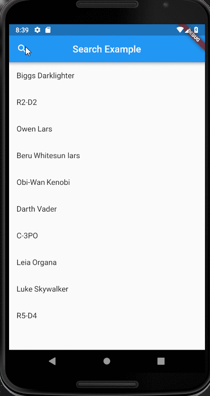

# flutter_api_filter_list

An article accompanying this project can be found [here](https://medium.com/flutterpub/a-simple-search-bar-in-flutter-f99aed68f523)

A new Flutter demo application built to show people an easy way to do the following:

- Query an API for some info using flutter package dio

- Create a page that generates a listView for the user based on the info retrieved from the API

- Add a search bar in the top App Bar where the user can filter their listView

Below is an example of the search bar in action:

